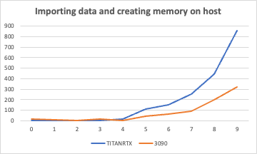
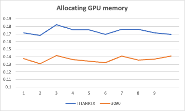
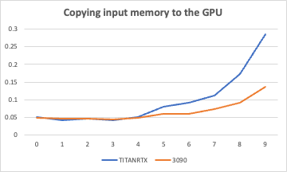
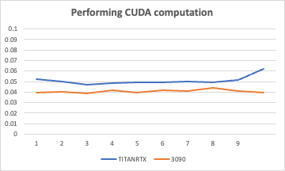
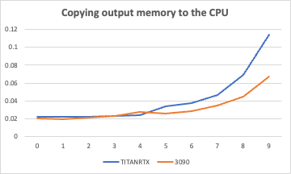
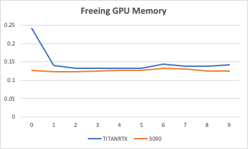

#[CSED490C] Assignment Report: Lab1_cuda

- Student Id : 20220848
- Name : 선민수

---

### 1. Answering follwing questions

##### Q: How many floating point operations are being performed in your vector add kernel? Explain.
##### A: `inputLength`. Floating point operation only occurs once when the calculating the single element of output vector whose leangth is `inputLength`.

##### Q: How many global memory reads are being performed by your kernel? Explain.
##### A: `2*inputLength`. Each add operation for a single element in output vector need total 2 global memory reads for `in1[idx]` and `in2[idx]`. And total length of the output vector is `inputLength`.

##### Q: How many global memory writes are being performed by your kernel? Explain.
##### A: `inputLength`. Global memory write occurs only once when saving the calculated value to the output vector whose length is `inputLength`.

---

### 2. `Template.cu`

```cpp
#include <gputk.h>

__global__ void vecAdd(float *in1, float *in2, float *out, int len) {
  //@@ Insert code to implement vector addition here
  int index = threadIdx.x + blockIdx.x * blockDim.x;;
  if(index < len)
    out[index] = in1[index] + in2[index];
}

int main(int argc, char **argv) {
  gpuTKArg_t args;
  int inputLength;
  float *hostInput1;
  float *hostInput2;
  float *hostOutput;
  float *deviceInput1;
  float *deviceInput2;
  float *deviceOutput;

  args = gpuTKArg_read(argc, argv);

  gpuTKTime_start(Generic, "Importing data and creating memory on host");
  hostInput1 =
      (float *)gpuTKImport(gpuTKArg_getInputFile(args, 0), &inputLength);
  hostInput2 =
      (float *)gpuTKImport(gpuTKArg_getInputFile(args, 1), &inputLength);
  hostOutput = (float *)malloc(inputLength * sizeof(float));
  gpuTKTime_stop(Generic, "Importing data and creating memory on host");

  gpuTKLog(TRACE, "The input length is ", inputLength);

  gpuTKTime_start(GPU, "Allocating GPU memory.");
  //@@ Allocate GPU memory here
  cudaMalloc((void **)&deviceInput1, inputLength * sizeof(float));
  cudaMalloc((void **)&deviceInput2, inputLength * sizeof(float));
  cudaMalloc((void **)&deviceOutput, inputLength * sizeof(float));

  gpuTKTime_stop(GPU, "Allocating GPU memory.");

  gpuTKTime_start(GPU, "Copying input memory to the GPU.");
  //@@ Copy memory to the GPU here
  cudaMemcpy(deviceInput1, hostInput1, inputLength * sizeof(float), cudaMemcpyHostToDevice);
  cudaMemcpy(deviceInput2, hostInput2, inputLength * sizeof(float), cudaMemcpyHostToDevice);

  gpuTKTime_stop(GPU, "Copying input memory to the GPU.");

  //@@ Initialize the grid and block dimensions here
  const int THREADS_PER_BLOCK = 128;

  dim3 gridDim_((inputLength + THREADS_PER_BLOCK -1) / THREADS_PER_BLOCK, 1, 1);
  dim3 blockDim_(THREADS_PER_BLOCK, 1, 1);

  gpuTKTime_start(Compute, "Performing CUDA computation");
  //@@ Launch the GPU Kernel here
  vecAdd<<<gridDim_, blockDim_>>>(deviceInput1, deviceInput2, deviceOutput, inputLength);

  cudaDeviceSynchronize();
  gpuTKTime_stop(Compute, "Performing CUDA computation");

  gpuTKTime_start(Copy, "Copying output memory to the CPU");
  //@@ Copy the GPU memory back to the CPU here
  cudaMemcpy(hostOutput, deviceOutput, inputLength * sizeof(float), cudaMemcpyDeviceToHost);

  gpuTKTime_stop(Copy, "Copying output memory to the CPU");

  gpuTKTime_start(GPU, "Freeing GPU Memory");
  //@@ Free the GPU memory here
  cudaFree(deviceInput1);
  cudaFree(deviceInput2);
  cudaFree(deviceOutput);

  gpuTKTime_stop(GPU, "Freeing GPU Memory");

  gpuTKSolution(args, hostOutput, inputLength);

  free(hostInput1);
  free(hostInput2);
  free(hostOutput);

  return 0;
}
```
---

### 3. Execution times
#### Execution Systems
All compilation and the executions are made on docker container.
##### TITANRTX
```shell
srun -p TITANRTX -N 1 -n 8 -t 02:00:00 --gres=gpu:1 --pty /bin/bash -l
```
- Driver Version : `530.30.02`
- Cuda Version : `12.1`
- Docker Image : `nvidia:cuda/12.1.0-devel-ubuntu22.04`
##### 3090
```shell
srun -p 3090 -N 1 -n 8 -t 02:00:00 --gres=gpu:1 --pty /bin/bash -l
```
- Driver Version : `530.30.02`
- Cuda Version : `12.1`
- Docker Image : `nvidia:cuda/12.1.0-devel-ubuntu22.04`
####Execution Times
All the time measurement unit is millisecond(ms).

##### 1 [Importing data and creating memory on host]

||0|1|2|3|4|5|6|7|8|9|
|:---:|:---:|:---:|:---:|:---:|:---:|:---:|:---:|:---:|:---:|:---:|
|TITANRTX|4.60396|2.25838|2.39982|2.73972|14.1392|109.145|149.509|250.292|443.713|855.705|
|3090|18.874|9.00381|1.62638|15.673|5.2051|41.1913|65.2419|90.0817|197.491|322.492|

<p align="center"></p>

##### 2 [Allocating GPU memory]

||0|1|2|3|4|5|6|7|8|9|
|:---:|:---:|:---:|:---:|:---:|:---:|:---:|:---:|:---:|:---:|:---:|
|TITANRTX|0.171383|0.167926|0.182018|0.175451|0.175444|0.169549|0.176271|0.175839|0.171201|0.169616|
|3090|0.137378|0.130478|0.141608|0.136248|0.134208|0.132088|0.141138|0.135248|0.136598|0.140859|

<p align="center"></p>

##### 3 [Copying input memory to the GPU]

||0|1|2|3|4|5|6|7|8|9|
|:---:|:---:|:---:|:---:|:---:|:---:|:---:|:---:|:---:|:---:|:---:|
|TITANRTX|0.051758|0.0424|0.046765|0.042084|0.050485|0.079116|0.091149|0.111952|0.173234|0.285482|
|3090|0.049169|0.046259|0.045349|0.043389|0.048949|0.058779|0.060329|0.074059|0.092389|0.137429|

<p align="center"></p>

##### 4 [Performing CUDA computation]

||0|1|2|3|4|5|6|7|8|9|
|:---:|:---:|:---:|:---:|:---:|:---:|:---:|:---:|:---:|:---:|:---:|
|TITANRTX|0.051921|0.050101|0.047293|0.048382|0.049446|0.049603|0.050109|0.049458|0.051683|0.062116|
|3090|0.039319|0.04053|0.03906|0.041749|0.039719|0.041409|0.04114|0.04397|0.040869|0.03946|

<p align="center"></p>

##### 5 [Copying output memory to the CPU]

||0|1|2|3|4|5|6|7|8|9|
|:---:|:---:|:---:|:---:|:---:|:---:|:---:|:---:|:---:|:---:|:---:|
|TITANRTX|0.022061|0.021986|0.022419|0.022597|0.023551|0.033841|0.037131|0.046682|0.069277|0.114213|
|3090|0.02028|0.01976|0.02114|0.02258|0.02789|0.02544|0.028009|0.034789|0.04434|0.066979|

<p align="center"></p>

##### 6 [Freeing GPU Memory]

||0|1|2|3|4|5|6|7|8|9|
|:---:|:---:|:---:|:---:|:---:|:---:|:---:|:---:|:---:|:---:|:---:|
|TITANRTX|0.240961|0.140013|0.131853|0.132165|0.132493|0.131748|0.144005|0.13896|0.138082|0.142221|
|3090|0.127438|0.123898|0.123428|0.125798|0.126268|0.127708|0.132269|0.130278|0.125409|0.124548|

<p align="center"></p>