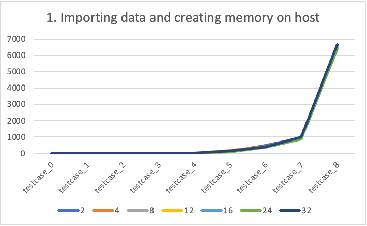
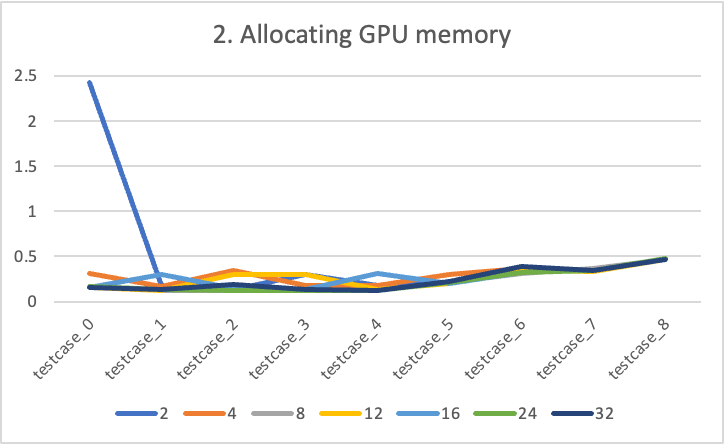

#[CSED490C] Assignment Report: Lab2_cuda

- Student Id : 20220848
- Name : 선민수

---

### 1. Answering follwing questions

##### Q: How many floating operations are being performed by your kernel?
##### A: Total `numAColumns x numBRows x numCRows x numCColumns` times of floating operations are performed. Current kernel does not use pre-computed value or something to reduce the floating point operations.

##### Q: How many global memory reads are being performed by your kernel?
##### A: Total `numAColumns x numBRows x numCRows x numCColumns` times of global memory reads. Current kernel needs all the elements for calculating a single element be loaded from global memory.

##### Q: How many global memory writes are being performed by your kernel?
##### A: Total `numCRows x numCColumns` times global memory writes. Current Kernel performs global memory writes for only storing the each element in the result matrix.

##### Q: Describe what further optimizations can be implemented to your kernel to achieve a performance speedup.
##### A: We can hide time for loading the input matrices by starting the threads when sufficient data are loaded into GPU's global memory. For example, we can launch thread block immediately when the sufficent data for calculating the a tile in matrix.

---

### 2. `Template.cu`

```cpp
#include <gputk.h>

#define TILE_WIDTH 32

#define gpuTKCheck(stmt)                                                     \
  do {                                                                    \
    cudaError_t err = stmt;                                               \
    if (err != cudaSuccess) {                                             \
      gpuTKLog(ERROR, "Failed to run stmt ", #stmt);                         \
      gpuTKLog(ERROR, "Got CUDA error ...  ", cudaGetErrorString(err));      \
      return -1;                                                          \
    }                                                                     \
  } while (0)

// Compute C = A * B
__global__ void matrixMultiplyShared(float *A, float *B, float *C,
                                     int numARows, int numAColumns,
                                     int numBRows, int numBColumns,
                                     int numCRows, int numCColumns) {
  //@@ Insert code to implement matrix multiplication here
  //@@ You have to use shared memory for this lab
  __shared__ float ds_A[TILE_WIDTH][TILE_WIDTH];
  __shared__ float ds_B[TILE_WIDTH][TILE_WIDTH];

  int bx = blockIdx.x;
  int by = blockIdx.y;
  int tx = threadIdx.x;
  int ty = threadIdx.y;

  int Row = by * blockDim.y + ty;
  int Col = bx * blockDim.x + tx;
  
  float Cvalue = 0.0;

  for (int phase = 0; phase < (numAColumns - 1) / TILE_WIDTH + 1; phase++) {
    if (Row < numCRows && phase * TILE_WIDTH + tx < numAColumns) ds_A[ty][tx] = A[Row * numAColumns + phase * TILE_WIDTH + tx];
    else ds_A[ty][tx] = 0.0;

    if (Col < numCColumns && phase * TILE_WIDTH + ty < numBRows) ds_B[ty][tx] = B[(phase * TILE_WIDTH + ty) * numBColumns + Col];
    else ds_B[ty][tx] = 0.0;

    __syncthreads();

    if (Row < numCRows && Col < numCColumns) { for (int ii = 0; ii < TILE_WIDTH; ii++) Cvalue += ds_A[ty][ii] * ds_B[ii][tx]; }

    __syncthreads();
  }

  if (Row < numCRows && Col < numCColumns) C[Row * numCColumns + Col] = Cvalue;
}

int main(int argc, char **argv) {
  gpuTKArg_t args;
  float *hostA; // The A matrix
  float *hostB; // The B matrix
  float *hostC; // The output C matrix
  float *deviceA;
  float *deviceB;
  float *deviceC;
  int numARows;    // number of rows in the matrix A
  int numAColumns; // number of columns in the matrix A
  int numBRows;    // number of rows in the matrix B
  int numBColumns; // number of columns in the matrix B
  int numCRows;    // number of rows in the matrix C (you have to set this)
  int numCColumns; // number of columns in the matrix C (you have to set
                   // this)

  args = gpuTKArg_read(argc, argv);

  gpuTKTime_start(Generic, "Importing data and creating memory on host");
  hostA = (float *)gpuTKImport(gpuTKArg_getInputFile(args, 0), &numARows,
                            &numAColumns);
  hostB = (float *)gpuTKImport(gpuTKArg_getInputFile(args, 1), &numBRows,
                            &numBColumns);
  //@@ Set numCRows and numCColumns
  numCRows    = numARows;
  numCColumns = numBColumns;
  //@@ Allocate the hostC matrix here
  hostC = (float *)malloc(numCRows * numCColumns * sizeof(float));
  gpuTKTime_stop(Generic, "Importing data and creating memory on host");

  gpuTKLog(TRACE, "The dimensions of A are ", numARows, " x ", numAColumns);
  gpuTKLog(TRACE, "The dimensions of B are ", numBRows, " x ", numBColumns);

  gpuTKTime_start(GPU, "Allocating GPU memory.");
  //@@ Allocate GPU memory here
  cudaMalloc((void **)&deviceA, numARows * numAColumns * sizeof(float));
  cudaMalloc((void **)&deviceB, numBRows * numBColumns * sizeof(float));
  cudaMalloc((void **)&deviceC, numCRows * numCColumns * sizeof(float));

  gpuTKTime_stop(GPU, "Allocating GPU memory.");

  gpuTKTime_start(GPU, "Copying input memory to the GPU.");
  //@@ Copy memory to the GPU here
  cudaMemcpy(deviceA, hostA, numARows * numAColumns * sizeof(float), cudaMemcpyHostToDevice);
  cudaMemcpy(deviceB, hostB, numBRows * numBColumns * sizeof(float), cudaMemcpyHostToDevice);

  gpuTKTime_stop(GPU, "Copying input memory to the GPU.");

  //@@ Initialize the grid and block dimensions here
  dim3 gridSize((numCColumns - 1) / TILE_WIDTH + 1, (numCRows - 1) / TILE_WIDTH + 1, 1);
  dim3 blockSize(TILE_WIDTH, TILE_WIDTH, 1);
  size_t sharedMemorySize = TILE_WIDTH * TILE_WIDTH * sizeof(float) * 2;

  gpuTKTime_start(Compute, "Performing CUDA computation");
  //@@ Launch the GPU Kernel here
  matrixMultiplyShared<<<gridSize, blockSize, sharedMemorySize>>>(deviceA, deviceB, deviceC, numARows, numAColumns, numBRows, numBColumns, numCRows, numCColumns);

  cudaDeviceSynchronize();
  gpuTKTime_stop(Compute, "Performing CUDA computation");

  gpuTKTime_start(Copy, "Copying output memory to the CPU");
  //@@ Copy the GPU memory back to the CPU here
  cudaMemcpy(hostC, deviceC, numCRows * numCColumns * sizeof(float), cudaMemcpyDeviceToHost);

  gpuTKTime_stop(Copy, "Copying output memory to the CPU");

  gpuTKTime_start(GPU, "Freeing GPU Memory");
  //@@ Free the GPU memory here
  cudaFree(deviceA);
  cudaFree(deviceB);
  cudaFree(deviceC);

  gpuTKTime_stop(GPU, "Freeing GPU Memory");

  gpuTKSolution(args, hostC, numCRows, numCColumns);

  free(hostA);
  free(hostB);
  free(hostC);

  return 0;
}

```
---

### 3. Execution times
#### Execution Systems
All compilation and the executions are made on docker container.
##### TITANXP
```shell
srun -p titanxp -N 1 -n 6 -t 02:00:00 --gres=gpu:1 --pty /bin/bash -l
```
- Cluster : `cse-cluster1.postech.ac.kr`
- Docker Image : `nvidia:cuda/12.0.1-devel-ubuntu22.04`
- Driver Version : `525.85.12`
- Cuda Version : `12.0`

####Execution Times
- All the time measurement unit is millisecond(ms).
- Single integer from index names or column names indicates the `TILE_WIDTH`.

##### 1 [Importing data and creating memory on host]

<p align="center"></p>
<p align="center"></p>

##### 2 [Allocating GPU memory]

<p align="center"></p>
<p align="center"></p>

##### 3 [Copying input memory to the GPU]

<p align="center"></p>
<p align="center"></p>

##### 4 [Performing CUDA computation]

<p align="center"></p>
<p align="center"></p>

##### 5 [Copying output memory to the CPU]

<p align="center"></p>
<p align="center"></p>

##### 6 [Freeing GPU Memory]

<p align="center"></p>
<p align="center"></p>

##### 7 [Execution times of the kernel for 4096 * 8000 and 8000 * 512 input matrix]

<p align="center"></p>
<p align="center"></p>