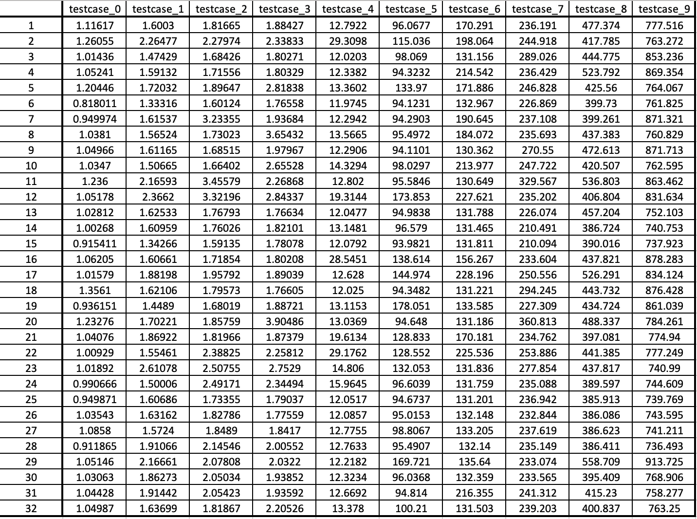
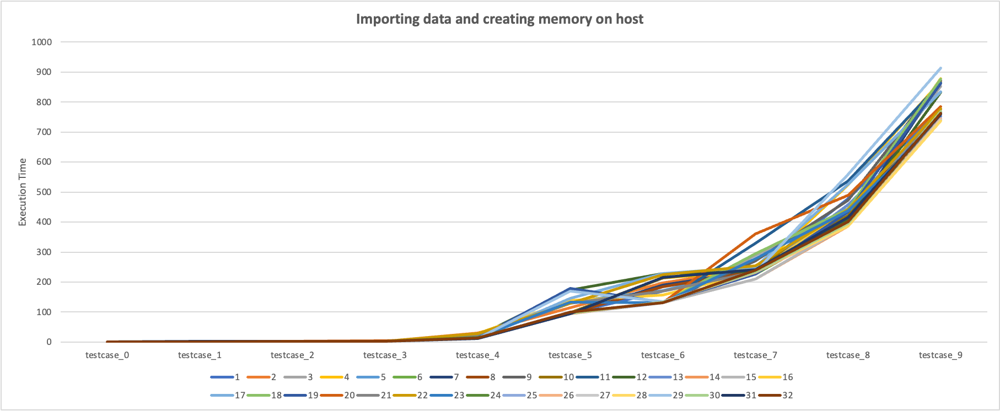
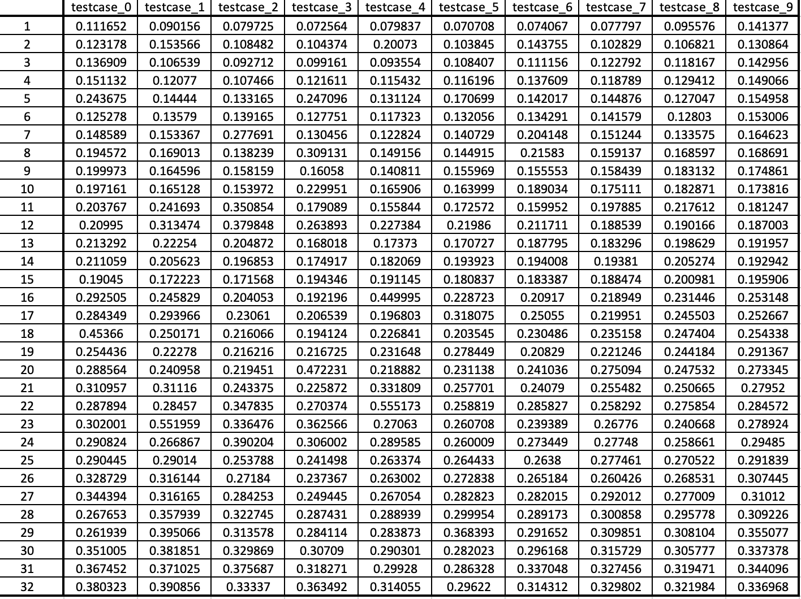
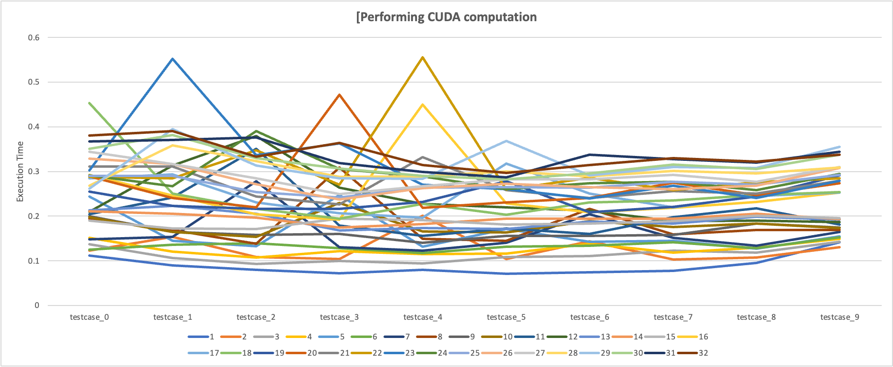
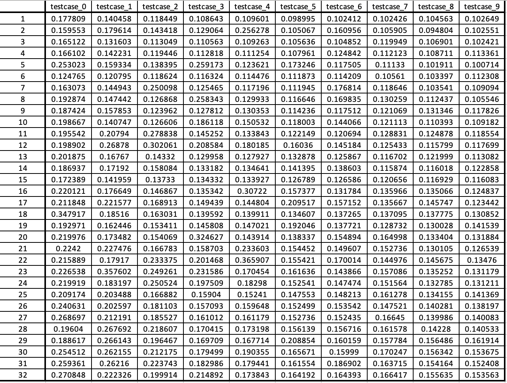
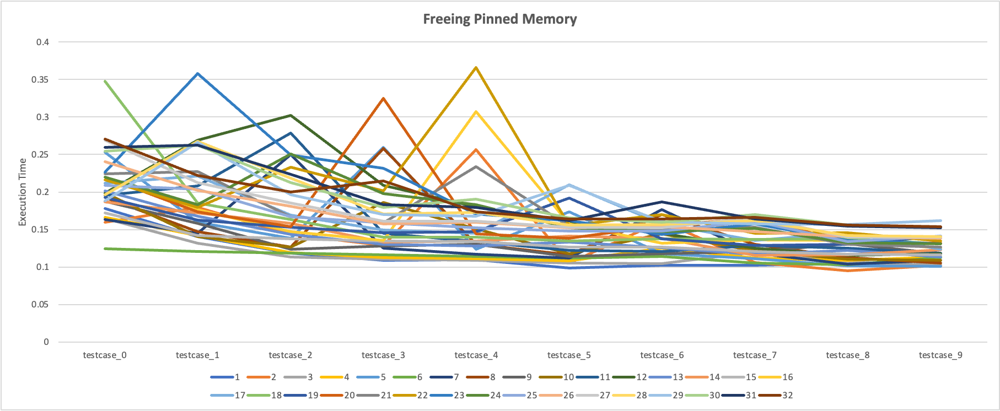
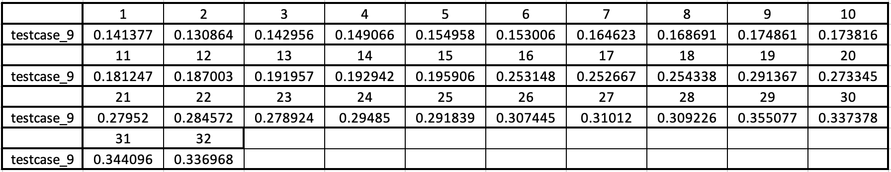
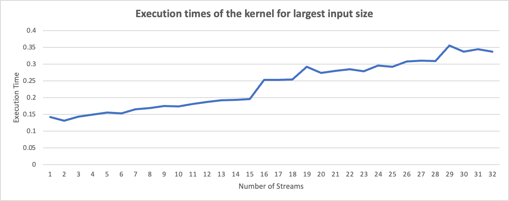

#[CSED490C] Assignment Report: Lab3_cuda

- Student Id : 20220848
- Name : 선민수

---

### 1. Answering follwing questions

##### Q: How many bytes of data (both read and write) are moved from host to device when using CUDA Streams?
##### A: Total bytes of data moved from host to device (or vice versa) is `2 * inputLength * sizeof(float)`. Using CUDA Streams does not decrease the total bytes of data moved between host and device, but hide latency.

##### Q: When should one use pinned memory? Explain.
##### A: Pinned memory can be used when hiding latency of moving data between host and device. In the case which do not have to hide latency, pinned memory is not necessary.

---

### 2. `Template.cu`

```cpp
#include <gputk.h>

#define N_STREAM 32
#define THREADS_PER_BLOCK 128

__global__ void vecAdd(float *in1, float *in2, float *out, int len) {
  int index = threadIdx.x + blockIdx.x * blockDim.x;
  if (index < len) {
    out[index] = in1[index] + in2[index];
  }
}

int main(int argc, char **argv) {
  gpuTKArg_t args;
  int inputLength;
  float *hostInput1;
  float *hostInput2;
  float *hostOutput;
  float *deviceInput1;
  float *deviceInput2;
  float *deviceOutput;
  unsigned int numStreams;

  args = gpuTKArg_read(argc, argv);

  gpuTKTime_start(Generic, "Importing data and creating memory on host");
  hostInput1 =
      (float *)gpuTKImport(gpuTKArg_getInputFile(args, 0), &inputLength);
  hostInput2 =
      (float *)gpuTKImport(gpuTKArg_getInputFile(args, 1), &inputLength);
  hostOutput = (float *)malloc(inputLength * sizeof(float));
  gpuTKTime_stop(Generic, "Importing data and creating memory on host");

  gpuTKLog(TRACE, "The input length is ", inputLength);

  gpuTKTime_start(GPU, "Allocating Pinned memory.");

  //@@ Allocate GPU memory here using pinned memory here
  cudaHostRegister(hostInput1, inputLength * sizeof(float), cudaHostRegisterDefault);
  cudaHostRegister(hostInput2, inputLength * sizeof(float), cudaHostRegisterDefault);
  cudaHostRegister(hostOutput, inputLength * sizeof(float), cudaHostRegisterDefault);
  cudaMalloc((void **)&deviceInput1, inputLength * sizeof(float));
  cudaMalloc((void **)&deviceInput2, inputLength * sizeof(float));
  cudaMalloc((void **)&deviceOutput, inputLength * sizeof(float));

  //@@ Create and setup streams 
  //@@ Calculate data segment size of input data processed by each stream 
  cudaStream_t *streams;
  numStreams = N_STREAM;
  streams = (cudaStream_t *)malloc(numStreams * sizeof(cudaStream_t));

  for (int i = 0; i < numStreams; i++) cudaStreamCreate(streams + i);
 
  gpuTKTime_start(Compute, "Performing CUDA computation");
  //@@ Perform parallel vector addition with different streams. 
  size_t segmentSize = (inputLength - 1) / numStreams + 1;
  for (unsigned int s = 0; s<numStreams; s++){
          //@@ Asynchronous copy data to the device memory in segments 
          //@@ Calculate starting and ending indices for per-stream data
          size_t p = s * segmentSize;
          size_t len = (s == numStreams - 1) ? inputLength - p : segmentSize;
          cudaMemcpyAsync(deviceInput1 + p, hostInput1 + p, len * sizeof(float), cudaMemcpyHostToDevice, streams[s]);
          cudaMemcpyAsync(deviceInput2 + p, hostInput2 + p, len * sizeof(float), cudaMemcpyHostToDevice, streams[s]);

          //@@ Invoke CUDA Kernel
          //@@ Determine grid and thread block sizes (consider ococupancy)     
          dim3 gridDim_((len - 1) / THREADS_PER_BLOCK + 1, 1, 1);
          dim3 blockDim_(THREADS_PER_BLOCK, 1, 1);
          vecAdd<<<gridDim_, blockDim_, 0, streams[s]>>>(deviceInput1 + p, deviceInput2 + p, deviceOutput + p, len);

          //@@ Asynchronous copy data from the device memory in segments 
          cudaMemcpyAsync(hostOutput + p, deviceOutput + p, len * sizeof(float), cudaMemcpyDeviceToHost, streams[s]);
  }

  //@@ Synchronize
  cudaDeviceSynchronize();

  gpuTKTime_stop(Compute, "Performing CUDA computation");


  gpuTKTime_start(GPU, "Freeing Pinned Memory");
  //@@ Destory cudaStream
  for (int i = 0; i < numStreams; i++) cudaStreamDestroy(streams[i]);

  //@@ Free the GPU memory here
  cudaFree(deviceInput1);
  cudaFree(deviceInput2);
  cudaFree(deviceOutput);

  gpuTKTime_stop(GPU, "Freeing Pinned Memory");

  gpuTKSolution(args, hostOutput, inputLength);

  free(hostInput1);
  free(hostInput2);
  free(hostOutput);

  return 0;
}

```
---

### 3. Execution times
#### Execution Systems
All compilation and the executions are made on docker container.
##### TITANXP
```shell
srun -p titanxp -N 1 -n 6 -t 02:00:00 --gres=gpu:1 --pty /bin/bash -l
```
- Cluster : `cse-cluster1.postech.ac.kr`
- Docker Image : `nvidia:cuda/12.0.1-devel-ubuntu22.04`
- Driver Version : `525.85.12`
- Cuda Version : `12.0`

####Execution
- All the time measurement unit is millisecond(ms).
- Single integer from index names or column names indicates the `N_STREAM` which indicates the number of stream used in that experiment.

####Execution Script
```shell
base="/workspace/csed490c-01/Lab3_cuda"
for streamSize in {1..32}
do
    cd $base/sources
    sed -i "3c\#define N_STREAM $streamSize" template.cu
    make template
    echo > $base/result_$streamSize
    for idx in {0..9}
    do
        cd $base/sources/VectorAdd/Dataset/$idx
        ./../../../StreamVectorAdd_template -e output.raw -i input0.raw,input1.raw -o o.raw -t vector >> $base/result_$streamSize
        echo >> $base/result_$streamSize
    done
done
```

##### 1 [Importing data and creating memory on host]
<p align="center"></p>
<p align="center"></p>

##### 2 [Performing CUDA computation]
<p align="center"></p>
<p align="center"></p>

##### 3 [Freeing Pinned Memory]
<p align="center"></p>
<p align="center"></p>

##### 4 [Execution times of the kernel for largest input size]

<p align="center"></p>
<p align="center"></p>

###### Some comments of `Execution times of the kernel for largest input size`
: We can see the execution time of kernel increases as the number of streams increasing. It is not what we expected, which expected to decrease as the number of streams increasing. The main reason of why this happend is related to the occupancy. As the number of threads per block is set to `128` in the code, we cannot see clear effect of increasing the number of streams with such size of input. With enough size of input provided to the kerenl, the execution time is expected to decrease.