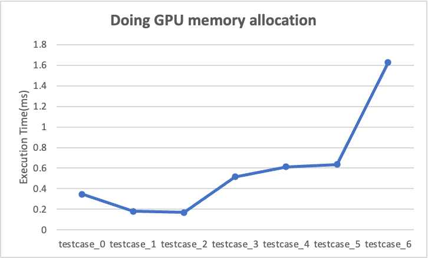
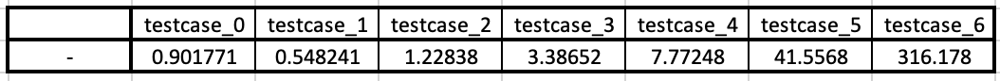

#[CSED490C] Assignment Report: Lab4_cuda

- Student Id : 20220848
- Name : 선민수

---

### 1. Answering follwing questions

##### Q: How many floating operations are being performed by your convolution kernel?
##### A: Total `Mask_width * Mask_width * width * height` floating operations.

##### Q: How many global memory reads are being performed by your convolution kernel?
##### A: Total `width * height + Mask_radius * 2 * (height * (width - 1) + width * (height - 1)) / TILE_WIDTH + 4 * Mask_radius * Mask_radius * ((width - 1) * (height - 1) / (TILE_WIDTH * TILE_WIDTH))` global memory reads.

##### Q: How many global memory writes are being performed by your convolution kernel?
##### A: Total `width * height` global memory writes.

##### Q: How much time is spent as an overhead cost for using the GPU for computation? Consider all code executed within your host function with the exception of the kernel itself, as overhead. How does the overhead scale with the size of the input?
##### A: When running the first testcase for convolutional computation, about 90% of total execution time was for the overhead. But when running the last testcase for convolutional computations, about 80% of total execution time was for the overhead. This ratio will be smaller as the input size gets bigger.

##### Q: What do you think happens as you increase the mask size (say to 1024) while you set the block dimensions to 16x16? What do you end up spending most of your time doing? Does that put other constraints on the way you’d write your algorithm?
##### A: In most of execution time, the kernel should copy the global memory to the shared memory, which is the total waste of GPU to wait for the full copy of data. The bigger mask size than the tile size will put a constraint of designing kernel where each thread cannot complete the convolution for a element of the output image. It should be handled with partial convolution for each elements.

---

### 2. `Template.cu`

```cpp
#include <gputk.h>

#define gpuTKCheck(stmt)                                                     \
  do {                                                                    \
    cudaError_t err = stmt;                                               \
    if (err != cudaSuccess) {                                             \
      gpuTKLog(ERROR, "Failed to run stmt ", #stmt);                         \
      return -1;                                                          \
    }                                                                     \
  } while (0)

#define Mask_width 5
#define Mask_radius Mask_width / 2
#define TILE_WIDTH 16
#define w (TILE_WIDTH + Mask_width - 1)
#define clamp(x) (min(max((x), 0.0), 1.0))

//@@ INSERT CODE HERE
__global__ void convolution(float *I, float * __restrict__ M, float *P, int channel, int width, int height) {
  __shared__ float Is[w][w];
  float Pvalue = 0.0f;
  int tx = threadIdx.x;
  int ty = threadIdx.y;
  int tz = threadIdx.z;
  int inputx = blockIdx.x * blockDim.x + tx;
  int inputy = blockIdx.y * blockDim.y + ty;
  int inputz = blockIdx.z * blockDim.z + tz;
  int inputxpb = inputx + TILE_WIDTH;
  int inputypb = inputy + TILE_WIDTH;
  int inputxnb = inputx - TILE_WIDTH;
  int inputynb = inputy - TILE_WIDTH;
  
  Is[Mask_radius + tx][Mask_radius + ty] = (inputx < height && inputy < width) ? I[(inputx * width + inputy) * channel + inputz] : 0.0f;
  
  if(tx < Mask_radius) {
    Is[Mask_radius + TILE_WIDTH + tx][Mask_radius + ty] = (inputxpb >= height)
      ? 0.0f
      : I[(inputxpb * width + inputy) * channel + inputz];
  }
  if(ty < Mask_radius) {
    Is[Mask_radius + tx][Mask_radius + TILE_WIDTH + ty] = (inputypb >= width)
      ? 0.0f
      : I[(inputx * width + inputypb) * channel + inputz];
  }
  if(tx < Mask_radius && ty < Mask_radius) {
    Is[Mask_radius + TILE_WIDTH + tx][Mask_radius + TILE_WIDTH + ty] = (inputxpb >= height || inputypb >= width)
      ? 0.0f
      : I[(inputxpb * width + inputypb) * channel + inputz];
  }
  
  if(tx >= TILE_WIDTH - Mask_radius) {
    Is[Mask_radius + tx - TILE_WIDTH][Mask_radius + ty] = (inputxnb < 0)
      ? 0.0f
      : I[(inputxnb * width + inputy) * channel + inputz];
  }
  if(ty >= TILE_WIDTH - Mask_radius) {
    Is[Mask_radius + tx][Mask_radius + ty - TILE_WIDTH] = (inputynb < 0)
      ? 0.0f
      : I[(inputx * width + inputynb) * channel + inputz];
  }
  if(tx >= TILE_WIDTH - Mask_radius && ty >= TILE_WIDTH - Mask_radius) {
    Is[Mask_radius + tx - TILE_WIDTH][Mask_radius + ty - TILE_WIDTH] = (inputxnb < 0 || inputynb < 0)
      ? 0.0f
      : I[(inputxnb * width + inputynb) * channel + inputz];
  }

  __syncthreads();
  if(inputx < height && inputy < width) {
    for(int i = 0; i < Mask_width; i++) {
      for(int j = 0; j < Mask_width; j++) {
        Pvalue += Is[tx + i][ty + j] * M[i * Mask_width + j];
      }
    }
    P[(inputx * width + inputy) * channel + inputz] = Pvalue;
  }
}

int main(int argc, char *argv[]) {
  gpuTKArg_t arg;
  int maskRows;
  int maskColumns;
  int imageChannels;
  int imageWidth;
  int imageHeight;
  char *inputImageFile;
  char *inputMaskFile;
  gpuTKImage_t inputImage;
  gpuTKImage_t outputImage;
  float *hostInputImageData;
  float *hostOutputImageData;
  float *hostMaskData;
  float *deviceInputImageData;
  float *deviceOutputImageData;
  float *deviceMaskData;

  arg = gpuTKArg_read(argc, argv); /* parse the input arguments */

  inputImageFile = gpuTKArg_getInputFile(arg, 0);
  inputMaskFile  = gpuTKArg_getInputFile(arg, 1);

  inputImage   = gpuTKImport(inputImageFile);
  hostMaskData = (float *)gpuTKImport(inputMaskFile, &maskRows, &maskColumns);

  assert(maskRows == 5);    /* mask height is fixed to 5 in this mp */
  assert(maskColumns == 5); /* mask width is fixed to 5 in this mp */

  imageWidth    = gpuTKImage_getWidth(inputImage);
  imageHeight   = gpuTKImage_getHeight(inputImage);
  imageChannels = gpuTKImage_getChannels(inputImage);

  outputImage = gpuTKImage_new(imageWidth, imageHeight, imageChannels);

  hostInputImageData  = gpuTKImage_getData(inputImage);
  hostOutputImageData = gpuTKImage_getData(outputImage);

  gpuTKTime_start(GPU, "Doing GPU Computation (memory + compute)");

  gpuTKTime_start(GPU, "Doing GPU memory allocation");
  //@@ INSERT CODE HERE
  cudaMalloc((void **)&deviceInputImageData, imageWidth * imageHeight * imageChannels * sizeof(float));
  cudaMalloc((void **)&deviceOutputImageData, imageWidth * imageHeight * imageChannels * sizeof(float));
  cudaMalloc((void **)&deviceMaskData, maskRows * maskColumns * sizeof(float));
  gpuTKTime_stop(GPU, "Doing GPU memory allocation");

  gpuTKTime_start(Copy, "Copying data to the GPU");
  //@@ INSERT CODE HERE
  cudaMemcpy(deviceInputImageData, hostInputImageData, imageWidth * imageHeight * imageChannels * sizeof(float), cudaMemcpyHostToDevice);
  cudaMemcpy(deviceMaskData, hostMaskData, maskRows * maskColumns * sizeof(float), cudaMemcpyHostToDevice);
  gpuTKTime_stop(Copy, "Copying data to the GPU");

  gpuTKTime_start(Compute, "Doing the computation on the GPU");
  //@@ INSERT CODE HERE
  dim3 dimGrid((imageHeight - 1)/TILE_WIDTH + 1, (imageWidth - 1)/TILE_WIDTH + 1, imageChannels);
  dim3 dimBlock(TILE_WIDTH, TILE_WIDTH, 1);
  convolution<<<dimGrid, dimBlock, w * w * sizeof(float)>>>(deviceInputImageData, deviceMaskData,
                                     deviceOutputImageData, imageChannels,
                                     imageWidth, imageHeight);
  cudaDeviceSynchronize();
  gpuTKTime_stop(Compute, "Doing the computation on the GPU");

  gpuTKTime_start(Copy, "Copying data from the GPU");
  //@@ INSERT CODE HERE
  cudaMemcpy(hostOutputImageData, deviceOutputImageData,
             imageWidth * imageHeight * imageChannels * sizeof(float),
             cudaMemcpyDeviceToHost);
  gpuTKTime_stop(Copy, "Copying data from the GPU");

  gpuTKTime_stop(GPU, "Doing GPU Computation (memory + compute)");

  gpuTKSolution(arg, outputImage);

  //@@ Insert code here
  cudaFree(deviceInputImageData);
  cudaFree(deviceOutputImageData);
  cudaFree(deviceMaskData);

  free(hostMaskData);
  gpuTKImage_delete(outputImage);
  gpuTKImage_delete(inputImage);

  return 0;
}
```
---

### 3. Execution times
#### Execution Systems
All compilation and the executions are made on docker container.
##### TITANXP
```shell
srun -p titanxp -N 1 -n 6 -t 02:00:00 --gres=gpu:1 --pty /bin/bash -l
```
- Cluster : `cse-cluster1.postech.ac.kr`
- Docker Image : `nvidia:cuda/12.0.1-devel-ubuntu22.04`
- Driver Version : `525.85.12`
- Cuda Version : `12.0`

####Execution Script
```shell
base="/workspace/csed490c-01/Lab4_cuda"
cd $base/sources
make template
echo > $base/result
for idx in {0..6}
do
    cd $base/sources/Convolution/Dataset/$idx
    ./../../../Convolution_template -e output.ppm -i input0.ppm,input1.raw -o o.ppm -t image >> $base/result
    echo >> $base/result
done
```

##### 1 [Doing GPU memory allocation]
<p align="center"></p>
<p align="center"></p>

##### 2 [Copying data to the GPU]
<p align="center"></p>
<p align="center"></p>

##### 3 [Doing the computation on the GPU]
<p align="center"></p>
<p align="center"></p>

##### 4 [Copying data from the GPU]
<p align="center"></p>
<p align="center"></p>

##### 5 [Doing GPU Computation (memory + compute)]
<p align="center"></p>
<p align="center"></p>