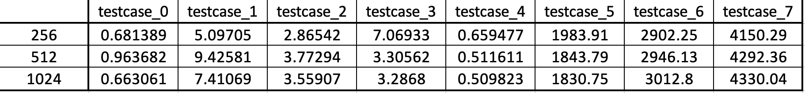
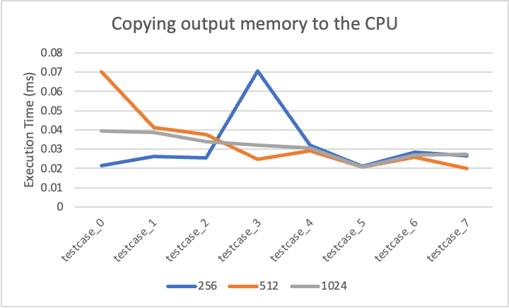

#[CSED490C] Assignment Report: Lab4_cuda

- Student Id : 20220848
- Name : 선민수

---

### 1. Answering follwing questions

##### Q: For the histogram kernel, how many atomic operations are being performed by your kernel? Explain.
##### A: Total `inputLength + 2 * NUM_BINS` times atomic operations. `inputLength` times atomic operations for the privated histogram operation, and `NUM_BINS` for collecting the privated histograms and another `NUM_BINS` for the cleaning up the bins.

##### Q: For the histogram kerenl, what contentions would you expect if every element in the array has the same value?
##### A: Since the atomic operation concentrates on the value that every element has, the each time for computing the atomic operation will increase.

##### Q: For the histogram kernel, what contentions would you expect if every element in the input array has a random value?
##### A: Since the values in the input array are random, bank conflicts in the shared memory by using the privatization would occur.

---

### 2. `Template.cu`

```cpp
#include <gputk.h>

#define NUM_BINS 4096

#define CUDA_CHECK(ans)                                                   \
  { gpuAssert((ans), __FILE__, __LINE__); }
inline void gpuAssert(cudaError_t code, const char *file, int line,
                      bool abort = true) {
  if (code != cudaSuccess) {
    fprintf(stderr, "GPUassert: %s %s %d\n", cudaGetErrorString(code),
            file, line);
    if (abort)
      exit(code);
  }
}

//@@ CUDA Kernel
__global__ void histo_kernel(unsigned int *Input, unsigned int *Bins, int inputLength)
{
  int tid = threadIdx.x;
  int idx = blockDim.x * blockIdx.x + tid;
  __shared__ unsigned int _private[NUM_BINS];

  while (tid < NUM_BINS)
  {
    _private[tid] = 0;
    tid += blockDim.x;
  }
  __syncthreads();

  while (idx < inputLength)
  {
    atomicAdd (&(_private[Input[idx]]), 1);
    idx += blockDim.x;
  }
  __syncthreads();

  tid = threadIdx.x;
  while (tid < NUM_BINS)
  {
    atomicAdd (&(Bins[tid]), _private[tid]);
    atomicMin (&(Bins[tid]), 127);
    tid += blockDim.x;
  }
  __syncthreads();
}

int main(int argc, char *argv[]) {
  gpuTKArg_t args;
  int inputLength;
  unsigned int *hostInput;
  unsigned int *hostBins;
  unsigned int *deviceInput;
  unsigned int *deviceBins;

  args = gpuTKArg_read(argc, argv);

  gpuTKTime_start(Generic, "Importing data and creating memory on host");
  hostInput = (unsigned int *)gpuTKImport(gpuTKArg_getInputFile(args, 0),
                                       &inputLength, "Integer");
  hostBins = (unsigned int *)malloc(NUM_BINS * sizeof(unsigned int));
  gpuTKTime_stop(Generic, "Importing data and creating memory on host");

  gpuTKLog(TRACE, "The input length is ", inputLength);
  gpuTKLog(TRACE, "The number of bins is ", NUM_BINS);

  gpuTKTime_start(GPU, "Allocating GPU memory.");
  //@@ Allocate GPU memory here
  cudaMalloc((void **)&deviceInput, inputLength * sizeof(unsigned int));
  cudaMalloc((void **)&deviceBins, NUM_BINS * sizeof(unsigned int));
  CUDA_CHECK(cudaDeviceSynchronize());
  gpuTKTime_stop(GPU, "Allocating GPU memory.");

  gpuTKTime_start(GPU, "Copying input memory to the GPU.");
  //@@ Copy memory to the GPU here
  cudaMemcpy(deviceInput, hostInput, inputLength * sizeof(unsigned int), cudaMemcpyHostToDevice);
  CUDA_CHECK(cudaDeviceSynchronize());
  gpuTKTime_stop(GPU, "Copying input memory to the GPU.");

  // Launch kernel
  // ----------------------------------------------------------
  gpuTKLog(TRACE, "Launching kernel");
  gpuTKTime_start(Compute, "Performing CUDA computation");
  //@@ Perform kernel computation here
  dim3 dimGrid(1, 1, 1);
  dim3 dimBlock(1024, 1, 1);
  histo_kernel<<<dimGrid, dimBlock, NUM_BINS * sizeof(unsigned int)>>> (deviceInput, deviceBins, inputLength);
  gpuTKTime_stop(Compute, "Performing CUDA computation");

  gpuTKTime_start(Copy, "Copying output memory to the CPU");
  //@@ Copy the GPU memory back to the CPU here
  cudaMemcpy(hostBins, deviceBins, NUM_BINS * sizeof(unsigned int),cudaMemcpyDeviceToHost);
  CUDA_CHECK(cudaDeviceSynchronize());
  gpuTKTime_stop(Copy, "Copying output memory to the CPU");

  gpuTKTime_start(GPU, "Freeing GPU Memory");
  //@@ Free the GPU memory here
  cudaFree(deviceInput);
  cudaFree(deviceBins);
  gpuTKTime_stop(GPU, "Freeing GPU Memory");

  // Verify correctness
  // -----------------------------------------------------
  gpuTKSolution(args, hostBins, NUM_BINS);

  free(hostBins);
  free(hostInput);
  return 0;
}
```
---

### 3. Execution times
#### Execution Systems
All compilation and the executions are made on docker container.
The number in the indices in the table and the legend in the chart means the number of threads per block.
##### TITANXP
```shell
srun -p titanxp -N 1 -n 6 -t 02:00:00 --gres=gpu:1 --pty /bin/bash -l
```
- Cluster : `cse-cluster1.postech.ac.kr`
- Docker Image : `nvidia:cuda/12.0.1-devel-ubuntu22.04`
- Driver Version : `525.85.12`
- Cuda Version : `12.0`

####Execution Script
```shell
base="/workspace"
cd $base/sources
make template
echo > $base/result
for idx in {0..7}
do
    echo "Testcase $idx"
    cd $base/sources/Histogram/Dataset/$idx
    ./../../../Histogram_template -e output.raw -i input.raw -o o.raw -t integral_vector >> $base/result
    echo >> $base/result
done
```

##### 1 [Doing GPU memory allocation]
<p align="center"></p>
<p align="center"></p>

##### 2 [Copying data to the GPU]
<p align="center"></p>
<p align="center"></p>

##### 3 [Doing the computation on the GPU]
<p align="center"></p>
<p align="center"></p>

##### 4 [Copying data from the GPU]
<p align="center"></p>
<p align="center"></p>

##### 5 [Doing GPU Computation (memory + compute)]
<p align="center"></p>
<p align="center"></p>