#[CSED490C] Assignment Report: Lab6_cuda

- Student Id : 20220848
- Name : 선민수

---

### 1. Answering follwing questions

##### Q: How many global memory reads are being performed by your kernel?
##### A: `numElements + numAux1 + numAux2 + 2 * numAux1 + 2 * numElements`

##### Q: How many global memory writes are being performed by your kernel?
##### A: `numElements + numAux1 + numAux1 + numAux2 + numAux2 + numAux1 + numElements`

##### Q: How many times does a single thread block synchronize to reduce its portion of the array to a single value?
##### A: `O(logN)`, where N is the block size

##### Q: Is it possible to get different results from running the serial version and parallel version of scan? Explain.
##### A: It is possible to get different results. It is because the input array is changed in the scanning time, the parallel version of can has different result. When the input chagne occurs after the local scan(scan in block), the change does not affect the result since the partial sum of that block where the change occured is already computed and never computed again.

---

### 2. `Template.cu`

```cpp
// Given a list (lst) of length n
// Output its prefix sum = {lst[0], lst[0] + lst[1], lst[0] + lst[1] + ...
// +
// lst[n-1]}

#include <gputk.h>

#define BLOCK_SIZE 512 //@@ You can change this

#define gpuTKCheck(stmt)                                                     \
  do {                                                                    \
    cudaError_t err = stmt;                                               \
    if (err != cudaSuccess) {                                             \
      gpuTKLog(ERROR, "Failed to run stmt ", #stmt);                         \
      gpuTKLog(ERROR, "Got CUDA error ...  ", cudaGetErrorString(err));      \
      return -1;                                                          \
    }                                                                     \
  } while (0)

__global__ void add_block_sum(float *input, float *output, int len){
  int bid = blockIdx.x;
  int idx = bid * blockDim.x + threadIdx.x;

  if (bid > 0 && idx < len)
    output[idx] += input[bid - 1];
}

__global__ void scan(float *input, float *output, float *aux, int len) {
  //@@ Modify the body of this function to complete the functionality of
  //@@ the scan on the device
  //@@ You may need multiple kernel calls; write your kernels before this
  //@@ function and call them from here
  __shared__ float T[BLOCK_SIZE];

  int tid = threadIdx.x;
  int base_idx = blockIdx.x * blockDim.x;

  // import data
  if (base_idx + tid < len)
    T[tid] = input[base_idx + tid];
  else
    T[tid] = 0.0f;

  // pre-scan step
  for (unsigned stride = 1; stride <= blockDim.x; stride *= 2) {
    __syncthreads();

    int index = (tid + 1) * 2 * stride - 1;

    if (index < BLOCK_SIZE)
      T[index] += T[index - stride];
  }

  // post-scan step
  for (int stride = BLOCK_SIZE / 4; stride > 0; stride /= 2) {
    __syncthreads();

    int index = (tid + 1) * stride * 2 - 1;

    if (index + stride < BLOCK_SIZE)
      T[index + stride] += T[index];
  }

  // export data
  __syncthreads();
  if (base_idx + tid < len)
    output[base_idx + tid] = T[tid];
  if (aux != NULL && tid == blockDim.x - 1)
    aux[blockIdx.x] = T[tid];
}

int main(int argc, char **argv) {
  gpuTKArg_t args;
  float *hostInput;  // The input 1D list
  float *hostOutput; // The output list
  float *deviceInput;
  float *deviceOutput;
  int numElements; // number of elements in the list

  float *aux_1_in;
  float *aux_1_out;
  float *aux_2_in;
  float *aux_2_out;
  int numAux1;
  int numAux2;

  args = gpuTKArg_read(argc, argv);

  gpuTKTime_start(Generic, "Importing data and creating memory on host");
  hostInput = (float *)gpuTKImport(gpuTKArg_getInputFile(args, 0), &numElements);
  hostOutput = (float *)malloc(numElements * sizeof(float));
  gpuTKTime_stop(Generic, "Importing data and creating memory on host");

  gpuTKLog(TRACE, "The number of input elements in the input is ",
        numElements);

  gpuTKTime_start(GPU, "Allocating GPU memory.");
  gpuTKCheck(cudaMalloc((void **)&deviceInput, numElements * sizeof(float)));
  gpuTKCheck(cudaMalloc((void **)&deviceOutput, numElements * sizeof(float)));

  numAux1 = (numElements - 1) / BLOCK_SIZE + 1;
  numAux2 = (numAux1 - 1) / BLOCK_SIZE + 1;
  gpuTKCheck(cudaMalloc((void **)&aux_1_in, numAux1 * sizeof(float)));
  gpuTKCheck(cudaMalloc((void **)&aux_1_out, numAux1 * sizeof(float)));
  gpuTKCheck(cudaMalloc((void **)&aux_2_in, numAux2 * sizeof(float)));
  gpuTKCheck(cudaMalloc((void **)&aux_2_out, numAux2 * sizeof(float)));
  gpuTKTime_stop(GPU, "Allocating GPU memory.");

  gpuTKTime_start(GPU, "Clearing output memory.");
  gpuTKCheck(cudaMemset(deviceOutput, 0, numElements * sizeof(float)));
  gpuTKTime_stop(GPU, "Clearing output memory.");

  gpuTKTime_start(GPU, "Copying input memory to the GPU.");
  gpuTKCheck(cudaMemcpy(deviceInput, hostInput, numElements * sizeof(float),
                     cudaMemcpyHostToDevice));
  gpuTKTime_stop(GPU, "Copying input memory to the GPU.");

  //@@ Initialize the grid and block dimensions here
  dim3 dimBlock(BLOCK_SIZE, 1, 1);

  dim3 dimGrid_1(numAux1, 1, 1);
  dim3 dimGrid_2(numAux2, 1, 1);
  dim3 dimGrid_3((numAux2 - 1) / BLOCK_SIZE, 1, 1);
  dim3 dimGrid_4(numAux2, 1, 1);
  dim3 dimGrid_5(numAux1, 1, 1);

  gpuTKTime_start(Compute, "Performing CUDA computation");
  
  //@@ Modify this to complete the functionality of the scan
  //@@ on the deivce
  scan<<<dimGrid_1, dimBlock, BLOCK_SIZE * sizeof(float)>>>(deviceInput, deviceOutput, aux_1_in, numElements);
  cudaDeviceSynchronize();
  scan<<<dimGrid_2, dimBlock, BLOCK_SIZE * sizeof(float)>>>(aux_1_in, aux_1_out, aux_2_in, numAux1);
  cudaDeviceSynchronize();
  scan<<<dimGrid_3, dimBlock, BLOCK_SIZE * sizeof(float)>>>(aux_2_in, aux_2_out, NULL, numAux2);
  cudaDeviceSynchronize();
  add_block_sum<<<dimGrid_4, dimBlock>>>(aux_2_out, aux_1_out, numAux1);
  cudaDeviceSynchronize();
  add_block_sum<<<dimGrid_5, dimBlock>>>(aux_1_out, deviceOutput, numElements);
  cudaDeviceSynchronize();

  gpuTKTime_stop(Compute, "Performing CUDA computation");

  gpuTKTime_start(Copy, "Copying output memory to the CPU");
  gpuTKCheck(cudaMemcpy(hostOutput, deviceOutput, numElements * sizeof(float),
                     cudaMemcpyDeviceToHost));
  gpuTKTime_stop(Copy, "Copying output memory to the CPU");

  gpuTKTime_start(GPU, "Freeing GPU Memory");
  cudaFree(deviceInput);
  cudaFree(deviceOutput);

  cudaFree(aux_1_in);
  cudaFree(aux_1_out);
  cudaFree(aux_2_in);
  cudaFree(aux_2_out);

  gpuTKTime_stop(GPU, "Freeing GPU Memory");

  gpuTKSolution(args, hostOutput, numElements);

  free(hostInput);
  free(hostOutput);

  return 0;
}
```

---
### 3. Execution times
#### Execution Systems
All compilation and the executions are made on docker container.
The number in the indices in the table and the legend in the chart means the number of threads per block.
##### TITANXP
```shell
srun -p titanxp -N 1 -n 6 -t 02:00:00 --gres=gpu:1 --pty /bin/bash -l
```
- Cluster : `cse-cluster1.postech.ac.kr`
- Docker Image : `nvidia:cuda/12.0.1-devel-ubuntu22.04`
- Driver Version : `525.85.12`
- Cuda Version : `12.0`

####Execution Script
```shell
base="/workspace"
cd $base/sources
make template
echo > $base/result
for idx in {0..9}
do
    echo "Testcase $idx"
    cd $base/sources/ListScan/Dataset/$idx
    ./../../../ListScan_template -e output.raw -i input.raw -o o.raw -t vector >> $base/result
    echo >> $base/result
done
```

##### 1 [Importing data and creating memory on host]
<p align="center">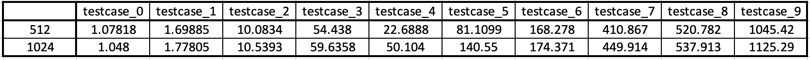</p>
<p align="center">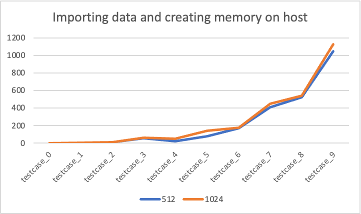</p>

##### 2 [Allocating GPU memory]
<p align="center">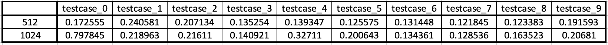</p>
<p align="center">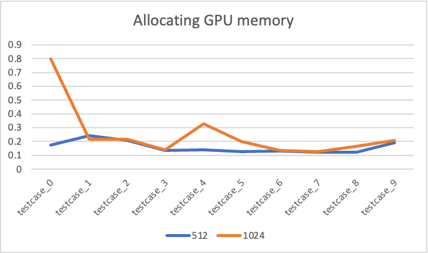</p>

##### 3 [Clearing output memory]
<p align="center">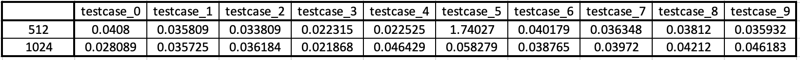</p>
<p align="center">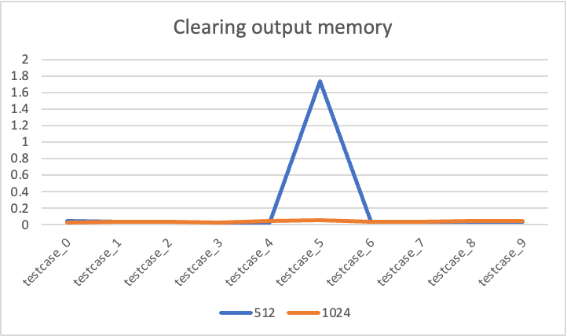</p>

##### 4 [Copying input memory to the GPU]
<p align="center">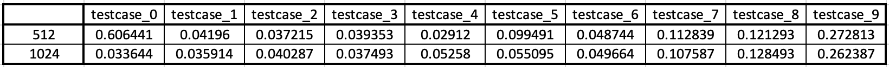</p>
<p align="center">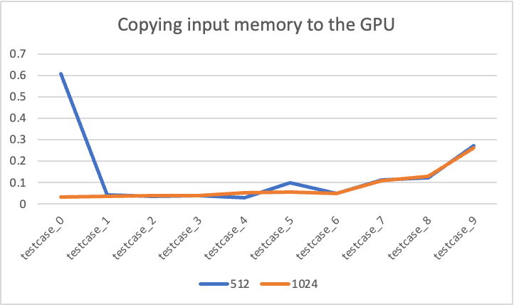</p>

##### 5 [Performing CUDA computation]
<p align="center">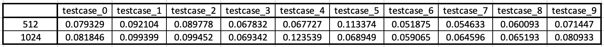</p>
<p align="center">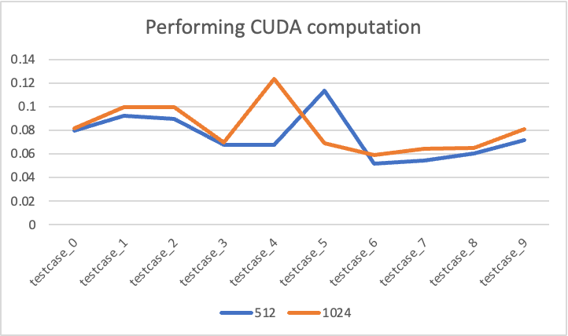</p>

##### 6 [Copying output memory to the CPU]
<p align="center">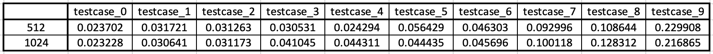</p>
<p align="center">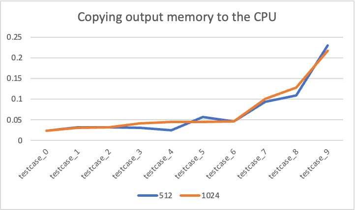</p>

##### 5 [Freeing GPU Memory]
<p align="center">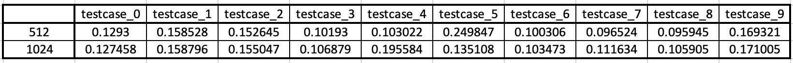</p>
<p align="center">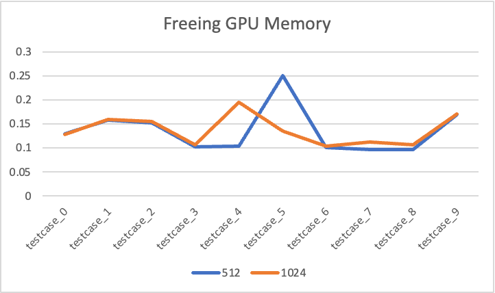</p>